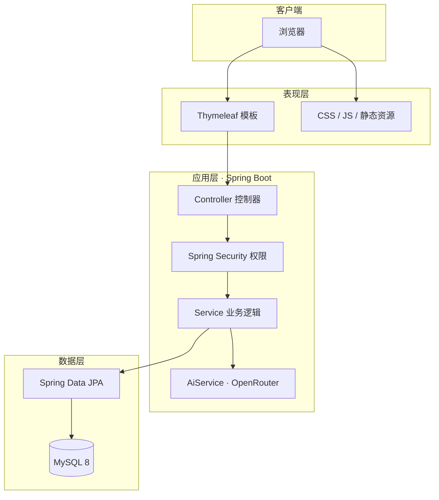

<div align="center">

# 🏥 Hospital Management System

**基于 Spring Boot + Thymeleaf 的 Web 医院管理系统**

[](https://spring.io/projects/spring-boot)
[](https://openjdk.org/)
[](https://www.mysql.com/)
[](https://www.thymeleaf.org/)
[](LICENSE)

面向患者、医生、管理员三类角色，提供预约挂号、排班管理、病历记录、公告通知与 AI 健康咨询等能力。

[功能特性](#-功能特性) · [技术架构](#-技术架构) · [快速开始](#-快速开始) · [项目结构](#-项目结构)

</div>

---

## 📖 项目简介

本项目是一套 **B/S 架构** 的医院信息管理系统，采用经典 **MVC 分层设计**，前端使用 **Thymeleaf** 服务端渲染，后端基于 **Spring Boot 3** 构建，数据持久化使用 **Spring Data JPA + MySQL**。

系统支持三种用户角色登录，各自拥有独立的功能模块与权限边界；公开页面可浏览医生列表、健康贴士与医院公告，登录后可进行预约、排班、病历等业务操作。

> **说明**：当前仓库中，应用源码位于 [`hospitalmanagement/`](hospitalmanagement/) 目录下。

---

## ✨ 功能特性

### 👤 患者（PATIENT）

| 模块 | 说明 |
|------|------|
| 账户注册 / 登录 | 患者自助注册，BCrypt 加密存储密码 |
| 预约挂号 | 按科室或指定医生选择时段预约 |
| 预约管理 | 查看个人预约列表及状态（待确认 / 已确认 / 已取消） |
| 病历查询 | 查看历史就诊记录 |
| 医生评价 | 对就诊医生进行评分与评论 |
| 个人资料 | 维护姓名、性别、电话、出生日期等信息 |
| 公告浏览 | 查看医院通知公告详情 |

### 🩺 医生（DOCTOR）

| 模块 | 说明 |
|------|------|
| 工作台 | 登录后进入医生专属首页 |
| 排班管理 | 设置出诊日期、时段（上午 / 下午 / 晚上）及限号人数 |
| 预约处理 | 查看并管理患者预约 |
| 病历填写 | 为就诊患者记录诊断结果与治疗方案 |
| 病历列表 | 查看本人创建的历史病历 |

### 🛡️ 管理员（ADMIN）

| 模块 | 说明 |
|------|------|
| 管理后台 | 管理员专属控制台 |
| 公告管理 | 发布与维护医院通知 |
| 系统管理 | 统筹平台基础数据（与用户表联动） |

### 🌐 公开功能

| 模块 | 说明 |
|------|------|
| 医院首页 | 展示推荐医生、健康贴士 |
| 医生列表 | 浏览全部医生及所属科室 |
| 留言/contact | 访客提交联系留言 |
| AI 健康咨询 | 接入 OpenRouter，提供智能问答（`/api/ai/ask`） |

---

## 🏗 技术架构



### 技术栈

| 类别 | 技术 |
|------|------|
| 后端框架 | Spring Boot 3.5、Spring MVC |
| 安全认证 | Spring Security 6、BCrypt |
| 模板引擎 | Thymeleaf + Thymeleaf Security Extras |
| 持久层 | Spring Data JPA、Hibernate |
| 数据库 | MySQL 8 |
| 工具 | Lombok、Jackson、Validation |
| 其他 | Spring Actuator、WebFlux（AI 调用）、DevTools |
| 构建工具 | Maven |
| JDK | 21 |

### 分层结构

```
Controller  →  接收 HTTP 请求，参数校验，返回视图或 JSON
Service     →  业务逻辑封装，事务管理
Repository  →  数据访问接口（JPA）
Entity      →  数据库实体映射
DTO         →  数据传输对象（如 DoctorDTO、ScheduleDTO）
Security    →  多角色认证与路由鉴权
```

---

## 📁 项目结构

```
hospitalmanagement/
├── pom.xml                          # Maven 依赖与构建配置
├── mvnw / mvnw.cmd                  # Maven Wrapper
├── src/main/java/com/example/hospital/
│   ├── HospitalmanagementApplication.java   # 启动类
│   ├── config/                      # 安全配置等
│   ├── controller/                  # 控制器（按业务划分）
│   ├── dto/                         # 数据传输对象
│   ├── entity/                      # JPA 实体
│   ├── repository/                  # 数据访问层
│   ├── security/                    # 用户认证与 UserDetails
│   └── service/                     # 业务接口与 impl 实现
├── src/main/resources/
│   ├── application.properties.example   # 配置模板（勿提交真实密钥）
│   ├── static/                      # CSS、JS、图片、视频
│   └── templates/                   # Thymeleaf 页面
│       ├── admin/                   # 管理员页面
│       ├── doctor/                  # 医生页面
│       └── patient/                 # 患者页面
└── src/test/java/                   # 单元测试
```

### 核心实体关系


| 实体 | 说明 |
|------|------|
| `Patient` / `Doctor` / `Admin` | 三类系统用户 |
| `Department` | 科室 |
| `Appointment` | 预约（状态：待确认 / 已确认 / 已取消） |
| `Schedule` | 医生排班（上午 / 下午 / 晚上） |
| `MedicalRecord` | 病历（诊断、治疗方案） |
| `DoctorReview` | 医生评价 |
| `Notice` | 医院公告 |
| `HealthTip` | 健康贴士 |
| `ContactMessage` | 访客留言 |

---

## 🚀 快速开始

### 环境要求

- **JDK 21+**
- **Maven 3.9+**（或使用项目自带的 `mvnw`）
- **MySQL 8.0+**

### 1. 克隆仓库

```bash
git clone https://github.com/Fjie17/hospitalmanagement.git
cd hospitalmanagement/hospitalmanagement
```

### 2. 创建数据库

```sql
CREATE DATABASE hospital_db DEFAULT CHARACTER SET utf8mb4 COLLATE utf8mb4_unicode_ci;
```

> 项目使用 `spring.jpa.hibernate.ddl-auto=update`，首次启动会自动建表。

### 3. 配置应用

```bash
cp src/main/resources/application.properties.example src/main/resources/application.properties
```

编辑 `application.properties`，填写数据库连接信息与 API Key：

```properties
spring.datasource.url=jdbc:mysql://localhost:3306/hospital_db?useSSL=false&serverTimezone=Asia/Shanghai&allowPublicKeyRetrieval=true
spring.datasource.username=root
spring.datasource.password=your_password
server.port=8080
openrouter.api.key=your_openrouter_api_key
```

> ⚠️ **`application.properties` 含敏感信息，已在 `.gitignore` 中排除，请勿提交到 Git。**

### 4. 启动项目

```bash
# Windows
mvnw.cmd spring-boot:run

# Linux / macOS
./mvnw spring-boot:run
```

启动成功后访问：**http://localhost:8080**

### 5. 注册与登录

1. 访问首页 `/`，浏览公开信息
2. 通过 `/register/patient` 或 `/register/doctor` 注册账号
3. 登录后系统按角色自动跳转：
   - 管理员 → `/admin/index`
   - 医生 → `/doctor/index`
   - 患者 → `/patient/index`

---

## 🔐 权限设计

| 路径前缀 | 所需角色 | 说明 |
|----------|----------|------|
| `/`, `/login`, `/register/**` | 公开 | 首页、登录、注册 |
| `/doctor_list`, `/healthTips` | 公开 | 医生列表、健康贴士 |
| `/patient/**` | `ROLE_PATIENT` | 患者功能 |
| `/doctor/**` | `ROLE_DOCTOR` | 医生功能 |
| `/admin/**` | `ROLE_ADMIN` | 管理员功能 |
| `/api/ai/ask` | 公开 | AI 问答接口 |

认证方式：**表单登录（Form Login）** + **Session**，密码使用 **BCrypt** 哈希存储。

---

## 🤖 AI 接口

```http
POST /api/ai/ask
Content-Type: text/plain

请问感冒应该注意什么？
```

需在 `application.properties` 中配置有效的 `openrouter.api.key`，默认调用 OpenRouter 的 DeepSeek 模型。

---

## 🛠 开发说明

| 配置项 | 默认值 | 说明 |
|--------|--------|------|
| `server.port` | `8080` | 服务端口 |
| `spring.jpa.hibernate.ddl-auto` | `update` | 自动更新表结构 |
| `spring.thymeleaf.cache` | `false` | 开发模式关闭模板缓存 |

打包运行：

```bash
mvnw.cmd clean package -DskipTests
java -jar target/hospitalmanagement-0.0.1-SNAPSHOT.jar
```

---

## 📄 许可证

本项目基于 [Apache License 2.0](LICENSE) 开源。

---

<div align="center">

**如果这个项目对你有帮助，欢迎 Star ⭐**

</div>
